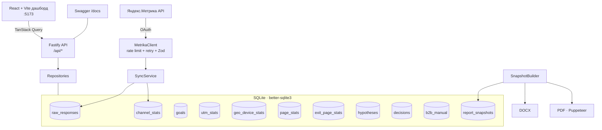

# QWEN.md — ProductCamp Conversion Analytics Dashboard

> Этот файл — **полный контекст продукта** для AI-агента Qwen Code. Положен в корень репозитория.
> При каждом новом сеансе агент должен прочитать этот файл, чтобы понять бизнес-контекст, архитектуру,
> методологию, текущее состояние и правила работы.

---

## 1. Обзор продукта

| Поле             | Значение                                                                                                                                                                                                                       |
| ---------------- | ------------------------------------------------------------------------------------------------------------------------------------------------------------------------------------------------------------------------------ |
| **Название**     | ProductCamp Conversion Analytics Dashboard                                                                                                                                                                                     |
| **Что делает**   | Локальный аналитический инструмент: подключается к Яндекс.Метрике по OAuth → кэширует данные в SQLite → поднимает интерактивный дашборд → помогает формулировать и проверять продуктовые гипотезы → генерирует DOCX/PDF-отчёты |
| **KPI кампании** | 300+ **платных** билетов                                                                                                                                                                                                       |
| **Стадия**       | v0.11.0 — рабочий продукт, фазы A–D завершены                                                                                                                                                                                  |
| **ЦА**           | Команда трека «Конверсии и лидген» ProductCamp: Лиза (лидирует направление), Сергей (аналитик/инженер), волонтёры команды маркетинга                                                                                           |
| **Запуск**       | `./run.sh` — одна команда, < 2 мин, без Docker, без облака                                                                                                                                                                     |

### Главная боль

Разрыв между формальными целями в Метрике (>300 заявок) и фактическими оплатами (~150).
Не понятно, какой трафик приносит реальные оплаты, а какой — пустые заявки.
Ручные выгрузки в Excel, отсутствие единого дашборда, гипотезы без приоритизации.

### Ключевой принцип

> **Заявка ≠ оплата.** Везде в коде и UI — явное разделение цели Метрики (заявка) и реальной оплаты.

---

## 2. Архитектура

### Компоненты



### Слои

| Слой       | Где                            | Технологии                                              |
| ---------- | ------------------------------ | ------------------------------------------------------- |
| Извлечение | `code/backend/src/metrika/`    | undici fetch, Zod, token-bucket, retry, backoff+jitter  |
| Хранение   | `code/backend/src/db/`         | better-sqlite3, миграции, repository pattern            |
| API        | `code/backend/src/routes/`     | Fastify 4, Zod, Swagger                                 |
| Аналитика  | `code/backend/src/analytics/`  | ICE (product), traffic-light, KPI-калькулятор           |
| Отчёты     | `code/backend/src/report/`     | `docx`, Puppeteer, immutable snapshot                   |
| Фронтенд   | `code/frontend/`               | React 18, Vite, TailwindCSS, ECharts, TanStack, Zustand |
| Общее      | `code/shared/` (`@pca/shared`) | типы, `ICE_CONFIG`, валидация гипотез, `reportSections` |

### Структура репозитория

```
.
├── code/
│   ├── backend/          # Fastify API, Metrika-клиент, SQLite, аналитика, отчёты
│   ├── frontend/         # React 18 + Vite дашборд
│   └── shared/           # общие типы, ICE_CONFIG, валидация гипотез
├── .qwen/skills/         # 4 skill-промпта методологии
├── .claude/skills/       # зеркала .qwen/skills/ для Claude Code
├── .github/              # CI/CD: ci, security, e2e, pr-lint, review, release
├── docs/
│   ├── architecture.md           # обзор архитектуры
│   ├── data-model.md             # модель данных (SQLite)
│   ├── anti-hallucination.md     # инварианты anti-hallucination
│   ├── methodology-*.md          # методология (гипотезы, ICE, Double Diamond)
│   ├── testing-strategy.md       # пирамида тестов, 100% покрытие
│   ├── runbook.md                # запуск, траблшутинг
│   ├── user-guide.md             # руководство пользователя
│   ├── metrika-api-cheatsheet.md # шпаргалка API Метрики
│   ├── project-structure.md      # гид по папкам
│   ├── decisions/                # ADR (архитектурные решения)
│   ├── specs/                    # спецификации фич (Spec-Driven Development)
│   └── en/                       # EN-зеркала документов
├── data/                 # SQLite, отчёты, экспорт DL (gitignored)
├── e2e/                  # Playwright e2e-тесты
├── QWEN.md               # этот файл
├── CLAUDE.md             # аналог для Claude Code
├── run.sh / setup.sh / init.sh  # запуск одной командой
└── package.json / pnpm-workspace.yaml  # pnpm монорепо
```

---

## 3. Модель данных

### Таблицы SQLite

| Таблица            | Назначение                          | Ключ / история                                                           |
| ------------------ | ----------------------------------- | ------------------------------------------------------------------------ |
| `goals`            | цели Метрики (seed)                 | PK `id`; `is_archived` если `id < 77`                                    |
| `raw_responses`    | сырые ответы API (прослеживаемость) | UNIQUE `(query_hash, date_from, date_to)`                                |
| `channel_stats`    | нормализованные метрики по каналам  | PK `(date, channel, utm_source, utm_medium, utm_campaign)` — **по дням** |
| `utm_stats`        | разбивка по UTM                     | PK `(date, utm_source, utm_medium, utm_campaign)` — **по дням**          |
| `geo_device_stats` | разбивка по стране + устройству     | PK `(date, country, device)` — **по дням**                               |
| `page_stats`       | поведение страниц входа             | PK `(date, page)` — **по дням**                                          |
| `exit_page_stats`  | поведение страниц выхода            | PK `(date, page)` — **по дням**                                          |
| `hypotheses`       | гипотезы в формате Воронковой       | `ice_score` GENERATED `impact*confidence*ease`; FK `parent_id` → problem |
| `b2b_manual`       | ручной B2B-пайплайн                 | этапы lead/negotiation/invoiced/paid                                     |
| `report_snapshots` | immutable снапшоты отчётов          | PK `id` (ulid)                                                           |
| `decisions`        | Decision Log                        | FK → `hypotheses`; `number` UNIQUE (DL-NNN)                              |
| `_migrations`      | трекинг применённых миграций        | PK `name`                                                                |

### Инварианты БД

- `decisions.hypothesis_id` → `hypotheses.id` (FK, `PRAGMA foreign_keys=ON`).
- При создании `decision` статус связанной гипотезы атомарно становится `outcome` (green/yellow/red).
- Гипотеза не сохраняется без формата Воронковой (≥3 допущения по 3 категориям, ≥2 метода) —
  проверка на уровне репозитория (`validateHypothesis` из `@pca/shared`).
- `decisions` требует ≥1 evidence.
- **История по дням**: повторный `pnpm sync` дополняет данные новыми датами, не затирая прошлые
  (`INSERT … ON CONFLICT`). Это даёт WoW-сравнения и воспроизводимость отчётов.

---

## 4. Методология

### Double Diamond (верхний уровень)

| Фаза         | Что происходит                                               | Инструмент                                       |
| ------------ | ------------------------------------------------------------ | ------------------------------------------------ |
| **Discover** | автосбор данных Метрики, авто-находки (аномалии, weak spots) | `pnpm sync`, дашборд                             |
| **Define**   | problem-гипотезы по структурированному формату + ICE         | `.qwen/skills/hypothesis-check/`                 |
| **Develop**  | solution-гипотезы к каждой problem, тот же формат + ICE      | `.qwen/skills/hypothesis-check/`                 |
| **Deliver**  | проверка top-N → Decision Log → action plan                  | `.qwen/skills/decision-log/`, страница Decisions |

### Формат гипотезы

**Problem:** `[Типичный пользователь]` испытывает `[конкретную трудность]` при `[действии/цели]`,
потому что `[что-то мешает]`.

**Solution:** Если `[мы сделаем ___]`, то `[пользователи смогут ___]`, что приведёт к
`[результату для бизнеса]`.

**Обязательные поля (UI блокирует сохранение без них):**

1. Структурный формат: Subject · Action · Solution · Condition («…, если …»).
2. ≥3 скрытых допущения по категориям: behavior / market / tech.
3. ≥2 метода проверки: synthetic CustDev / live / quantitative / market.
4. ICE = Impact × Confidence × Ease (произведение, 1–1000) с rationale для каждого.
5. Светофор 🟢/🟡/🔴 с конкретными порогами и метриками.
6. Дедлайн проверки (в днях).

### ICE = I × C × E (произведение)

Каждый фактор 1–10. Итог — **произведение** (диапазон 1–1000), не среднее.

| Диапазон | Бакет    | Цвет      |
| -------- | -------- | --------- |
| 1–125    | `low`    | серый     |
| 126–342  | `medium` | жёлтый    |
| 343–729  | `high`   | оранжевый |
| 730–1000 | `top`    | красный   |

**Anchor-описания:**

- Impact 10 = «гарантированно +≥30 билетов до старта»; 5 = «+10 при удачном раскладе».
- Confidence 10 = «есть прямые данные/интервью»; 5 = «аналогии и логика, не проверено».
- Ease 10 = «полдня без согласований»; 5 = «неделя + согласование».

### Риски решения

Для каждой solution-гипотезы: Value risk, Usability risk, Feasibility risk, Business viability, Legal/reputational.

### Decision Log

Каждая проверенная гипотеза → запись DL-{N}: что проверяли, что узнали (3–5 пунктов),
цитаты/данные (обязательно), исход по светофору, следующий шаг с дедлайном.
При сохранении статус связанной гипотезы автоматически меняется на outcome.

---

## 5. Anti-hallucination: инварианты

1. **Прослеживаемость.** Любое число в дашборде/отчёте сводится к строке `raw_responses` в SQLite.
2. **Воспроизводимость.** Один `snapshotId` → идентичный контент DOCX и PDF.
3. **Никакого `Date.now()` в render-пути** отчёта — только `snapshot.generatedAt`.
4. **Никаких LLM-вызовов на проде** в пути генерации отчёта. AI только на стороне разработки.
5. **Заявка ≠ оплата** — явное разделение везде.
6. **Валидация ответов API** — Zod; при несовпадении — `MetrikaSchemaError` + дамп в `data/errors/`.
7. **B2B входит в KPI 300** и ведётся вручную (`b2b_manual`).

---

## 6. Тестирование

### Пирамида тестов

| Уровень     | Инструмент                       | Что тестируем                                                         |
| ----------- | -------------------------------- | --------------------------------------------------------------------- |
| Unit        | Vitest (node)                    | чистые функции: ICE, traffic-light, KPI, валидация гипотез, Zod-схемы |
| Integration | Vitest (node)                    | репозитории на реальной SQLite, API через `app.inject()`              |
| Component   | Vitest (jsdom) + Testing Library | React-компоненты, валидации форм                                      |
| E2E         | Playwright (chromium)            | страницы рендерятся; блокировка сохранения; DOCX/PDF генерация        |
| Acceptance  | Playwright                       | сквозной цикл «гипотеза → DL → статус», прослеживаемость, детерминизм |

### Команды

```bash
pnpm test       # vitest run по всем пакетам
pnpm coverage   # с порогом 100% (ломает CI при регрессе)
pnpm e2e        # Playwright
```

### Правила

- Порог покрытия **100%** (v8). Исключены только bootstrap/entry-файлы.
- Integration > mocks для I/O: бьём по реальной тестовой SQLite, мок только на внешней границе (HTTP к Метрике).
- Каждый PR проходит CI: lint, typecheck, coverage, build, e2e.

---

## 7. Стек (фиксированный)

| Слой       | Технология                                                                 |
| ---------- | -------------------------------------------------------------------------- |
| Runtime    | Node.js 20 LTS                                                             |
| Язык       | TypeScript 5, strict (noUncheckedIndexedAccess, noUnusedLocals/Parameters) |
| Backend    | Fastify 4                                                                  |
| Validation | Zod                                                                        |
| HTTP       | undici (built-in fetch)                                                    |
| Storage    | SQLite via `better-sqlite3` (без Docker)                                   |
| Frontend   | React 18 + Vite 5                                                          |
| UI         | TailwindCSS + shadcn/ui                                                    |
| Charts     | Apache ECharts (`echarts-for-react`)                                       |
| Tables     | TanStack Table v8                                                          |
| State      | Zustand + TanStack Query                                                   |
| DOCX       | `docx`                                                                     |
| PDF        | Puppeteer (рендер той же HTML-страницы превью)                             |
| Dates      | `date-fns` + `date-fns-tz` (Europe/Moscow)                                 |
| Tests      | Vitest + Playwright                                                        |
| Lint       | ESLint flat config + Prettier                                              |
| PM         | pnpm 9                                                                     |

**Запрещено** добавлять зависимости вне списка без ADR в `docs/decisions/`.

---

## 8. Дашборд: страницы

Глобальные фильтры (sticky header): период (7д / 14д / произвольный),
каналы, сегмент B2C / B2C+B2B / B2B, показ архивных целей.

| Страница       | Что показывает                                                                                                                                               |
| -------------- | ------------------------------------------------------------------------------------------------------------------------------------------------------------ |
| **Overview**   | KPI-стрип (цель 300, заявки, gap), графики: визиты/заявки по дням, заявки по дням, микс каналов, **топ стран** (bar), **доля устройств** (donut), weak spots |
| **Traffic**    | бар каналов, grouped-bar «визиты vs заявки», таблица каналов, UTM-разбивка, бейдж низкого покрытия UTM                                                       |
| **Audience**   | графики и таблицы по стране (bar) и устройству (donut): визиты / пользователи / заявки / CR                                                                  |
| **Behavior**   | страницы входа (startURL) и выхода (exitURL): графики + таблицы (визиты / отказы / заявки / CR)                                                              |
| **Trends**     | линия визитов и заявок по дням + WoW (неделя-к-неделе) со стрелками                                                                                          |
| **Funnel**     | воронка «заявка ≠ оплата»: Визиты → Заявки B2C → Билеты B2B → Оплачено B2B                                                                                   |
| **B2B**        | CRUD-таблица сделок, pipeline по этапам (lead/negotiation/invoiced/paid)                                                                                     |
| **Hypotheses** | AI-генерация problem/solution гипотез, ICE-сортировка, риски, планы проверки                                                                                 |
| **Decisions**  | Decision Log: CRUD решений, привязка к гипотезам, светофор                                                                                                   |
| **Report**     | сборка snapshot, AI-анализ (опц.), экспорт DOCX/PDF, полный просмотр отчёта на экране                                                                        |
| **Sources**    | «Откуда эта цифра?» — поиск сырого ответа Метрики по `raw_response_id`                                                                                       |

---

## 9. Поток данных

```
./run.sh
  → миграции
  → pnpm sync (Метрика → raw_responses → channel_stats / utm_stats / geo_device_stats / page_stats / exit_page_stats)
     ИЛИ pnpm seed (демо-данные без токена)
  → Fastify API (:4000, Swagger /docs)
     → React-дашборд (:5173, TanStack Query)
        → SnapshotBuilder (buildSnapshot({ from, to }))
           → DOCX / PDF
  → HypothesesService (generateHypotheses(snapshotId))
     → hypotheses таблица
  → Decision Log (createDecision)
     → авто-обновление статуса гипотезы
```

### API эндпоинты

| Метод | Путь                        | Описание                                     |
| ----- | --------------------------- | -------------------------------------------- |
| GET   | `/api/health`               | health check: counterId, metrikaTokenPresent |
| GET   | `/api/metrics/channels`     | channel_stats за период                      |
| GET   | `/api/metrics/utm`          | utm_stats за период                          |
| GET   | `/api/metrics/geo-device`   | geo_device_stats за период                   |
| GET   | `/api/metrics/pages`        | page_stats за период                         |
| GET   | `/api/metrics/exit-pages`   | exit_page_stats за период                    |
| GET   | `/api/metrics/primary-goal` | авто-определённая KPI-цель                   |
| GET   | `/api/metrics/goals`        | все цели (seed)                              |
| POST  | `/api/sync`                 | запуск sync Метрики                          |
| POST  | `/api/report/snapshot`      | build snapshot за период                     |
| POST  | `/api/report/insights`      | AI-анализ снапшота                           |
| POST  | `/api/report/hypotheses`    | генерация гипотез из снапшота                |
| POST  | `/api/report/generate`      | экспорт DOCX/PDF                             |
| CRUD  | `/api/hypotheses`           | гипотезы                                     |
| CRUD  | `/api/decisions`            | Decision Log                                 |
| CRUD  | `/api/b2b`                  | B2B-пайплайн                                 |
| GET   | `/api/metrics/raw/:id`      | сырой ответ по ID (Sources)                  |

---

## 10. Яндекс.Метрика API

- **OAuth:** заголовок `Authorization: OAuth <token>` (не Bearer), scope `metrika:read`.
- **Base URL:** `https://api-metrika.yandex.net`.
- **Эндпоинты:** `/management/v1/counter/{id}/goals`, `/stat/v1/data`, `/stat/v1/data/bytime`, `/stat/v1/data/drilldown`.
- **Rate limit:** ~1000 req/час → token-bucket.
- **Retry:** экспоненциальный backoff с jitter на 429/5xx, до 5 попыток.
- **Чанки:** период > 7 дней разбивается на дневные чанки.
- **Валидация:** все ответы проходят Zod; при несовпадении — `MetrikaSchemaError` + дамп.
- **Архивация целей:** `is_archived = 1`, если `id < 77` (конфигурируемо).

---

## 11. Спеки фич (Spec-Driven Development)

Спецификации в `docs/specs/`:

| #   | Спека                                                       | Статус                                    |
| --- | ----------------------------------------------------------- | ----------------------------------------- |
| 001 | Двойная KPI-цель: оплата + заявка                           | `superseded` (заменена 002)               |
| 002 | Переработка продукта: AI-гипотезы, отчёт ГОСТ, дашборд, ops | `accepted` (фазы A–D done, E in progress) |

### Фаза 002 — подфазы

| Фаза  | Описание                                                                                                     | Статус         |
| ----- | ------------------------------------------------------------------------------------------------------------ | -------------- |
| **A** | Движок AI-гипотез (≥10 problem + ≥10 solution, ICE, риски, планы проверки)                                   | ✅ Done        |
| **B** | Отчёт ≥40 стр. A4 по ГОСТ, DOCX/PDF download, «Перестроить отчёт»                                            | ✅ Done        |
| **C** | Дашборд: больше графиков (Overview), фильтры по датам, легенды, гео/устройства на Overview, пустые состояния | ✅ Done        |
| **D** | Ops UI: Settings (ключ/токен/счётчик), «История отчётов», убрать Sources                                     | ✅ Done        |
| **E** | Аудит парсинга Метрики, полная пирамида тестов, README/доки/CLAUDE/QWEN, релиз                               | 🔄 In progress |

---

## 12. ADR (архитектурные решения)

| #   | Решение                                                                   |
| --- | ------------------------------------------------------------------------- |
| 001 | Монорепо pnpm-workspace, Fastify 4 + React 18 + SQLite, TypeScript strict |
| 005 | ICE = произведение (I × C × E), не среднее                                |
| 006 | Пирамида тестов: Vitest + Playwright, порог 100% покрытия                 |
| 007 | Парсер Метрики + хранение истории по дням в SQLite (без Docker)           |

---

## 13. Skill-промпты

Лежат в `.qwen/skills/` (и зеркалируются в `.claude/skills/`):

| Скрипт                       | Назначение                                              |
| ---------------------------- | ------------------------------------------------------- |
| `hypothesis-check/SKILL.md`  | структурирование problem/solution гипотез + ICE         |
| `synthetic-custdev/SKILL.md` | симуляция 5 архетипов ЦА ProductCamp для CustDev        |
| `market-scan/SKILL.md`       | рыночный анализ конкурирующих конференций с источниками |
| `decision-log/SKILL.md`      | шаблон DL-NNN и промпт генерации черновика              |

---

## 14. CI/CD

| Workflow       | Триггер        | Что делает                                                            |
| -------------- | -------------- | --------------------------------------------------------------------- |
| `ci.yml`       | push main / PR | lint + typecheck + coverage (100% порог) + build                      |
| `security.yml` | push main / PR | gitleaks (секрет-скан) + pnpm audit (report-only)                     |
| `e2e.yml`      | push / PR      | Playwright smoke (chromium), отчёт-артефакт при падении               |
| `pr-lint.yml`  | PR             | Conventional Commits заголовок                                        |
| `review.yml`   | PR             | AI code review (пропускается без ANTHROPIC_API_KEY)                   |
| `release.yml`  | тег `v*.*.*`   | verify → package (tar.gz + frontend zip + checksums) → GitHub Release |

---

## 15. Правила работы для AI-агента

1. **Методология обязательна.** Гипотеза — строго формат (`docs/methodology-hypotheses.md`),
   ICE = произведение (`docs/methodology-ice.md`), Double Diamond (`docs/methodology-double-diamond.md`).
2. **Anti-hallucination** (`docs/anti-hallucination.md`): любое число → `raw_responses`;
   никакого `Date.now()`/LLM в render-пути; заявка ≠ оплата.
3. **100% покрытие** (`docs/testing-strategy.md`): каждая фича — с тестами.
4. **Spec-Driven Development** (`docs/specs/README.md`): нетривиальная фича (>1 файла или >~30 мин) —
   сначала спека в `docs/specs/NNN-*.md`, затем реализация.
5. **Поток работы:** ветка → Conventional Commits → локальный гейт (lint/typecheck/coverage/build) → merge → CI.
6. **Зависимости вне стека — только через ADR** в `docs/decisions/`.
7. **Текущий релиз:** v0.11.0. Семантическое версионирование + CHANGELOG.

---

## 16. Decision Log (последние 3 решения)

> Заполняется после каждого цикла проверки гипотезы. Полные записи — `data/decisions/DL-*.md`.

- **DL-001** — не заполнено (пока ни одной завершённой проверки)
- **DL-002** — \_ \_
- **DL-003** — \_ \_
