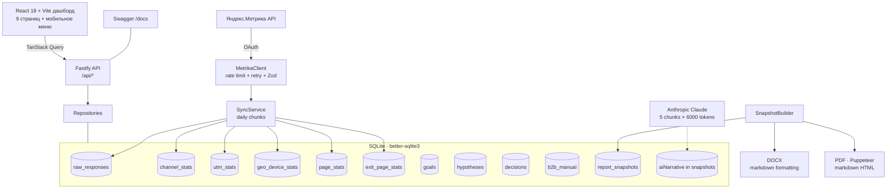

# Архитектура

> 🇷🇺 Русский. Обзорный документ; детали — в ADR (`docs/decisions/`) и коде.

Локальный инструмент: парсит Яндекс.Метрику → SQLite → дашборд → DOCX/PDF. Никакого облака.

**Текущая версия:** v2.5.6 (2026-05-27)

## Компоненты

## Слои

| Слой       | Где                                      | Технологии                                           |
| ---------- | ---------------------------------------- | ---------------------------------------------------- |
| Извлечение | `code/backend/src/metrika/`              | undici fetch, Zod, token-bucket, retry               |
| Хранение   | `code/backend/src/db/`                   | better-sqlite3, миграции, repository pattern         |
| API        | `code/backend/src/routes/`               | Fastify 4, Zod, Swagger                              |
| Аналитика  | `code/backend/src/analytics/`            | ICE, traffic-light, KPI, forecast                    |
| AI-анализ  | `code/backend/src/report/ai-insights.ts` | Anthropic Claude, 5 chunks × 6000 tokens             |
| Отчёты     | `code/backend/src/report/`               | `docx` (markdown), Puppeteer (markdown HTML)         |
| Фронтенд   | `code/frontend/`                         | React 18, Vite, Tailwind, ECharts, TanStack, Zustand |
| Общее      | `code/shared/`                           | типы, `ICE_CONFIG`, валидация, report-sections       |

## Страницы дашборда (9)

| Страница  | URL         | Описание                                                                            |
| --------- | ----------- | ----------------------------------------------------------------------------------- |
| Обзор     | `/`         | KPI (4 карточки), визиты/заявки, микс каналов, топ стран, устройства, UTM, страницы |
| Трафик    | `/traffic`  | Бар-чарт каналов, визиты vs заявки, таблица каналов, UTM-разбивка                   |
| Поведение | `/behavior` | CR страниц входа, отказы, таблицы с подсветкой, рекомендации                        |
| Воронка   | `/funnel`   | 4 этапа, анализ потерь, CR по каналам, B2B по этапам                                |
| Цели      | `/goals`    | Прогресс-ринг, метрики, B2B сделки, прогноз                                         |
| Отчёт     | `/report`   | Snapshot, AI-анализ (HTML), экспорт DOCX/PDF                                        |
| История   | `/history`  | Список снапшотов, «Просмотреть» → сохранённый AI-анализ                             |
| Настройки | `/settings` | OAuth, COUNTER_ID, GOAL_ID select, ANTHROPIC_API_KEY, sync с прогрессом             |
| Справка   | `/help`     | Документация, FAQ (10 вопросов), глоссарий                                          |

## Ключевые решения

- SQLite, без Docker (`decisions/002-sqlite-vs-postgres.md`, `007-data-history-by-day.md`).
- ICE = произведение (`decisions/005-ice-product-vs-mean.md`).
- PDF через Puppeteer из той же страницы превью (`decisions/003-pdf-via-puppeteer.md`).
- B2B — ручной ввод (`decisions/004-b2b-manual-entry.md`).
- Тестовое окружение и 100% покрытие (`decisions/006-test-tooling.md`).
- AI-анализ в 5 chunked запросах с max_tokens 6000 (v2.4.0+).
- DOCX/PDF с markdown-форматированием (таблицы, списки, bold, italic).
