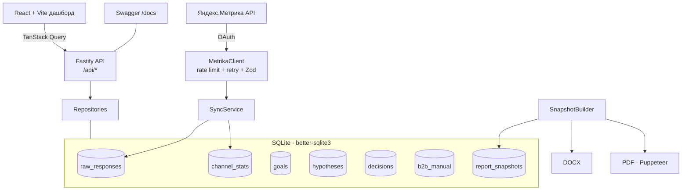

# Архитектура

> 🇷🇺 Русский. Обзорный документ; детали — в ADR (`docs/decisions/`) и коде.

Локальный инструмент: парсит Яндекс.Метрику → SQLite → дашборд → DOCX/PDF. Никакого облака.

## Компоненты

## Слои

| Слой       | Где                                           | Технологии                                           |
| ---------- | --------------------------------------------- | ---------------------------------------------------- |
| Извлечение | `code/backend/src/metrika/`                   | undici fetch, Zod, token-bucket, retry               |
| Хранение   | `code/backend/src/db/`                        | better-sqlite3, миграции, repository pattern         |
| API        | `code/backend/src/routes/`                    | Fastify 4, Zod, Swagger                              |
| Аналитика  | `code/backend/src/analytics/` _(итерации 6+)_ | ICE, traffic-light, KPI, forecast                    |
| Отчёты     | `code/backend/src/report/` _(итерации 8–10)_  | `docx`, Puppeteer, immutable snapshot                |
| Фронтенд   | `code/frontend/`                              | React 18, Vite, Tailwind, ECharts, TanStack, Zustand |
| Общее      | `code/shared/`                                | типы, `ICE_CONFIG`, валидация гипотез                |

## Поток данных (Double Diamond)

`./run.sh` → миграции → `sync` (Discover) → дашборд/гипотезы (Define/Develop) →
Decision Log (Deliver) → отчёт из snapshot. Подробнее — `methodology-double-diamond.md`.

## Ключевые решения

- SQLite, без Docker (`decisions/002-sqlite-vs-postgres.md`, `007-data-history-by-day.md`).
- ICE = произведение (`decisions/005-ice-product-vs-mean.md`).
- PDF через Puppeteer из той же страницы превью (`decisions/003-pdf-via-puppeteer.md`).
- B2B — ручной ввод (`decisions/004-b2b-manual-entry.md`).
- Тестовое окружение и 100% покрытие (`decisions/006-test-tooling.md`).
